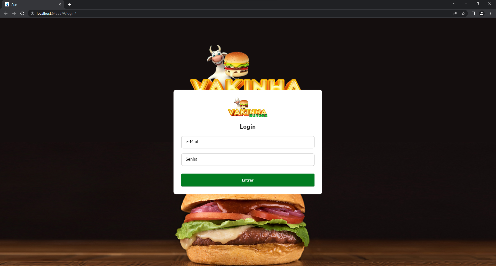
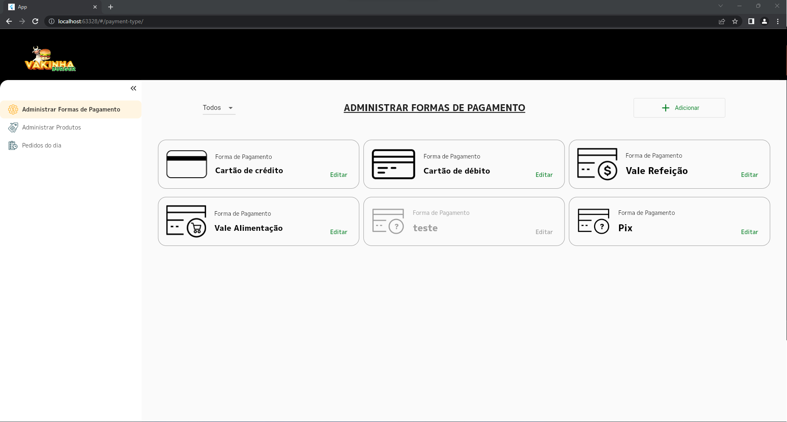
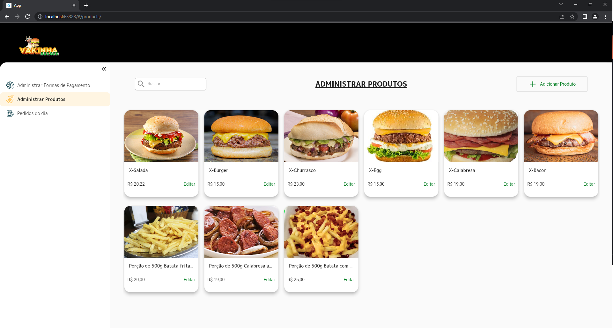
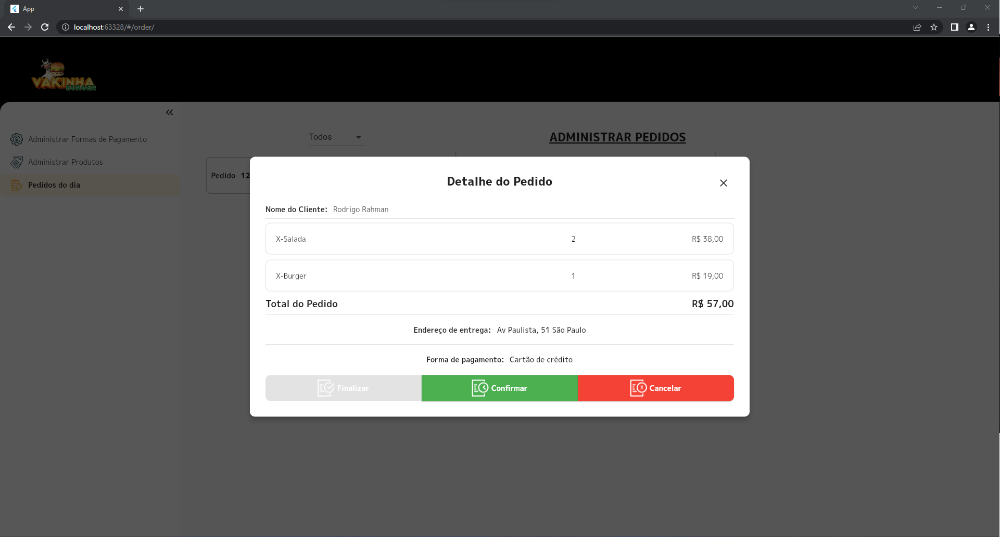

# Backoffice Delivery

Bem-vindo ao repositório do Backoffice Delivery! Este é um projeto desenvolvido durante a Dart Week, um evento promovido pela Academia do Flutter com o instrutor Rodrigo Rahman. O Backoffice Delivery é um aplicativo web construído com o Flutter Web e tem como objetivo auxiliar restaurantes e estabelecimentos no gerenciamento de entregas.

## Funcionalidades
O Backoffice Delivery oferece as seguintes funcionalidades:

Login: Os usuários podem acessar o aplicativo de forma segura, protegendo as informações do estabelecimento.

Gerenciamento de Tipos de Pagamentos: É possível adicionar, editar e remover diferentes formas de pagamento para atender às necessidades dos clientes.

Gerenciamento de Produtos: Os estabelecimentos podem cadastrar, atualizar e controlar seu catálogo de produtos de forma intuitiva e eficiente.

Gerenciamento de Pedidos: O Backoffice Delivery permite o controle completo dos pedidos recebidos, desde a visualização dos detalhes até a atualização do status de entrega.

## Imagens das Telas

A seguir, você pode conferir algumas capturas de tela do aplicativo:

### Tela de Login


### Gerenciamento de Tipos de Pagamentos


### Gerenciamento de Produtos


### Gerenciamento de Pedidos


## Pré-Requisitos

O Backoffice Delivery é uma aplicação web que precisa que o back-end esteja online para que possa ser executado corretamente. No curso foi utilizada uma **API Rest** via [Json Rest Server](https://pub.dev/packages/json_rest_server) e para utilizá-la deve-se seguir estes passos:

Instalar o Json Rest Server:

```sh
dart pub global activate json_rest_server
```

Clonar o repositório da API:

```sh
git clone https://github.com/rodrigorahman/dw10_delivery_api.git
```

Navegue até o diretório clonado:

```sh
cd dw10_delivery_api
```

Executar a api através do comando:

```sh
json_rest_server run
```

## Instalação do Backoffice Delivery

Siga as instruções abaixo para configurar e executar o projeto em seu ambiente local:

Certifique-se de ter o Flutter instalado em sua máquina. Para obter as instruções de instalação, visite a documentação oficial do Flutter.

Clone este repositório para o seu computador utilizando o seguinte comando:

```sh
git clone https://github.com/ricardoemerson/delivery_backoffice.git
```

Navegue até o diretório clonado:

```sh
cd delivery_backoffice
```

Execute o seguinte comando para obter as dependências do projeto:

```sh
flutter pub get
```

Agora você está pronto para executar o aplicativo em seu ambiente local. Utilize o comando:

```sh
flutter run -d chrome
```

Isso abrirá o aplicativo Backoffice Delivery em seu navegador.

## Contribuição
Contribuições são bem-vindas! Se você tiver sugestões, correções de bugs ou melhorias para o projeto, sinta-se à vontade para abrir uma issue ou enviar um pull request.

Antes de enviar um pull request, certifique-se de que seu código está alinhado com as boas práticas de desenvolvimento e que seja compatível com o projeto.

## Licença
Este projeto está licenciado sob a Licença MIT. Consulte o arquivo LICENSE para obter mais informações.
